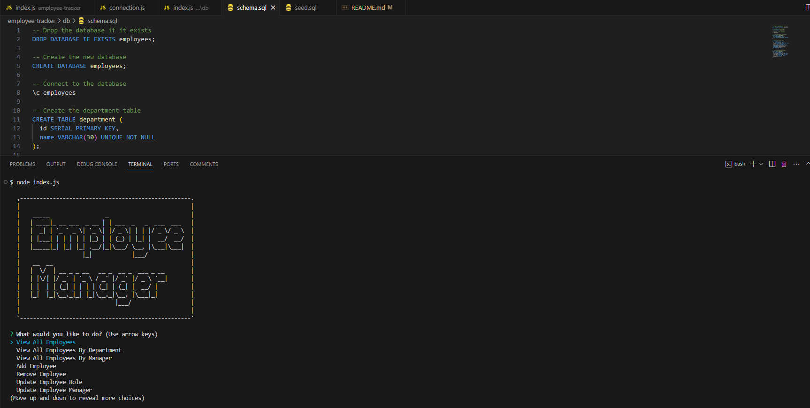

# SQL: Employee-Tracker

## Description

The challenge is to build a command-line Employee Tracker that uses a SQL database. This application allows the user to easily mangage employees by department and role.

## User Story

```md
AS A business owner
I WANT to be able to view and manage the departments, roles, and employees in my company
SO THAT I can organize and plan my business
```

## Acceptance Criteria

```md
GIVEN a command-line application that accepts user input
WHEN I start the application
THEN I am presented with the following options: view all departments, view all roles, view all employees, add a department, add a role, add an employee, and update an employee role
WHEN I choose to view all departments
THEN I am presented with a formatted table showing department names and department ids
WHEN I choose to view all roles
THEN I am presented with the job title, role id, the department that role belongs to, and the salary for that role
WHEN I choose to view all employees
THEN I am presented with a formatted table showing employee data, including employee ids, first names, last names, job titles, departments, salaries, and managers that the employees report to
WHEN I choose to add a department
THEN I am prompted to enter the name of the department and that department is added to the database
WHEN I choose to add a role
THEN I am prompted to enter the name, salary, and department for the role and that role is added to the database
WHEN I choose to add an employee
THEN I am prompted to enter the employee’s first name, last name, role, and manager, and that employee is added to the database
WHEN I choose to update an employee role
THEN I am prompted to select an employee to update and their new role and this information is updated in the database
```
## Table of Contents
- [Installation](#installation)
- [Usage](#usage)
- [License](#license)
- [Example](#example)
- [Walkthrough](#walkthrough)
- [Questions](#questions)

## Installation
Follow these steps to install the application:
1. run npm install to install the dependencies for the application

## Usage
Follow these steps to run the application:
1. run node index.js in your terminal to run the application

## License
None


## Example
**CLI Employee Tracker:**


## Walkthrough
[Walkthrough Video Link](https://drive.google.com/file/d/1xmen5343KJRTeisf0Nd2l0SFC1hS6JyB/view?usp=sharing)

## Questions
For any questions, please reach out at:
- [ebaby-ak](https://github.com/ebaby-ak)
